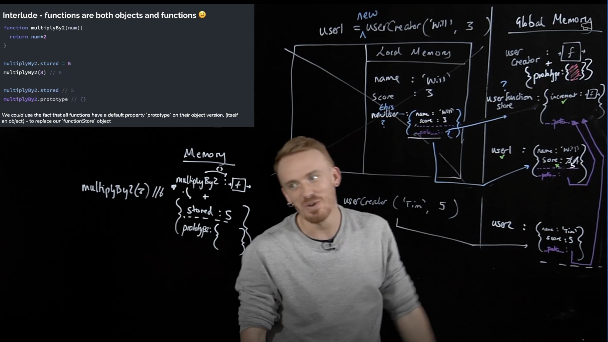

# Day 9: Classes and Prototypes - Wrapping up:

### Classes and Prototypes:

In JavaScript we have multiple ways to create an object:
1. Create a new object with {} parenthesis contains the properties and methods.
2. Create a new object with {} parenthesis without parameters and methods.
3. Create a new object with with Object.create(null) => create a new empty object.[^1]
4. Create a new object with with a function returns a new object.
5. Create a new object with class syntax sugar and 'new' keyword.

[^1]: with using prototype to add methods when I used the functions or functions creator, this way is make a link to the prototype that has the methods inside, the _ _ proto _ _ is same the prototype and assign to an object contains properties and methods.

These methods allow us to add or modify properties using dot notation. Some of those methods suitable and others not, because some, store more lines of code for each new object created, others need to modify each instance of the objects created and more. Some other methods are suitable because they are more flexible and efficient. We use 'this' keyword to assign to current object that the method called with.
All objects has a prototype own from the global Object prototype. If function needed not found in _ _ proto _ _, JavaScript will search for it in global Object prototype (this one assigned by another _ _ proto_ _).


In we have multiple functions inside each other, we need to pass them 'this' using .call() function and because JavaScript will consider the new this inside the inner function referred to the global this that not help and unwanted. That's happening because JavaScript passed 'this' to the recent-one function with this object called, then next one in chain will referred to global. **In ES6, the arrow function comes to solve these 'this' problems (in arrow functions 'this' is lexically scoped).** If arrow function used in global scope, then the 'this' will assign to the global this.


'new' is a keyword that make a lot of things automatically, such as create a new object, returned the object automatically, assign to the object functions object (first refers to the instance other refers where the functions stored), returns the object as 'this' reference, the _ _ proto _ _ assigned to the creator function (constructor function) prototype object.
The function is an object consists of function execution and object containing prototype that contains the empty object.


After in JavaScript, a syntactic sugar comes to solve the problem with creating a new object with parameters then adding the assignment to the prototype object, the new syntax is used 'class' keyword with new, but this is working exactly the same way as the 'new' keyword with prototype object. We use capital case in the first letter of the class name.


## Checkpoint Summary :vertical_traffic_light:

The key points covered:

- How to create a new Object?
- Creator Function and Properties.
- What is the Prototype? How it used?
- What is the Prototype Chaining?
- How 'new' keyword is used? What is the automation it does?
- ES6 Syntax Sugar with 'new' keyword.

---

### Question 1:
Write a closure named createCounter that takes an initial value start and returns a function. The returned function, when invoked, should increment the counter by 1 and return the updated value.

```javascript
    const createCounter = (start) => {
        const increase = () => {
            // console.log("Value before: " + start);
            start ++;
            // console.log("Value after: " + start);
        }
        return increase;
    }
    const counter = createCounter(3);
    counter();
    counter();
```

---

### Sources to review
- #### [MDN](https://developer.mozilla.org/)
- #### [Free code camp](https://www.freecodecamp.org/)