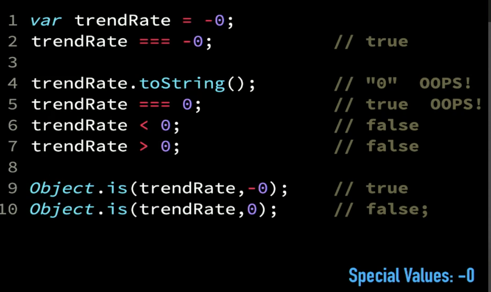

# Day 11: Introduction - Types - Coercion:

### Types:

"In JavaScript, everything is an Object." - this is false, because we don't say that if most of the values are behave as objects. In JavaScript, we have multiple types, called "Primitive Types" and they are:
- undefined (not object)
- string (not object)
- number (not object)
- boolean (not object)
- object
- symbol (added recently in JS) (not object)
- null (not object)
- bigint (not object)
- function (object)
- array (object)

In JavaScript, variables does not have types, values do. We use operator typeof to determine **what the type of the value** is in the variable and its return value is always a string. The type of null is object and this is a bug in JavaScript ;). The bigint declaration deferent about regular numbers. The deference between undefined and undeclared variables is: undefined means that is definitely a variable created and at the moment, it has no value, undeclared means the variable is never been created in any scope that we have access to. Uninitialized variables is not initialized (TDZ: Temporal Dead Zone).

The "NaN" is not means "Not a Number", it means the value is not correct not represent a number (or there is not a number to represent this thing). Operation on number, try to convert the part of the operation to a number, if can will do it, unless will return NaN. NaN is the only value not equal to itself (NaN !== NaN), the type of the value NaN is a number. In ES6, JavaScript had Number.isNaN(value) function to used in better way than isNaN() general function (it's just invalid number).

Negative Zero, it is exist in JavaScript numbers :). It's work with comparison wrongly and when stringify -0, so we use Object.is(variable, -0) to check if -0 equal to 0 or not. The Math.sign(value) returns -1 if sign is negative and 1 if sign is positive, but in 0 case return 0 if only zero but if -0 will return -0 (Whaaat!!).



Fundamental Objects use new: Object() , Array() , Function() , Date() , RegExp() , Error(), it's used as constructor. Fundamental Objects don't use new: String() , Number() , Boolean(), it's used as function.

### Coercion:

To change the type from non-primitive to primitive, we need to convert it to primitive using JavaScript primitive function that convert, called ToPrimitive. ToPrimitive examples, valueOf(), toString().

**ToString** that converts any Object (or value) to a string, and in strings we use toString() first then valueOf() function. **ToNumber** that converts any Object (or value) to a numerical ("" : return 0 !!), and in numbers we use valueOf() first then toString() function. **ToBoolean** that converts any Object (or value) to a truthy boolean value or falsy boolean value. The falsy boolean values are: "", 0, -0, null, undefined, NaN, false others are truthy. If I pass a false value to Boolean constructor, the boolean value returns true because constructor will check whether it a falsy value or not.
Boolean when converted to number: 1 < 2 < 3 => true => (1 < 2) < 3 => (true) < 3 => 1 < 3 => true
and 3 > 2 > 1 => false => (3 > 2) > 1 => (true) > 1 => 1 > 1 => false

Type Coercion refers to the process of automatic or implicit conversion of values from one data type to another. This includes conversion from Number to String, String to Number, Boolean to Number etc. when different types of operators are applied to the values.

We have `String Literals with ${ Variable }` to add variables, String literals make concatenation under the hood. Sometimes we need to know how variables are converted to handle the wrong values. We can convert the numbers using unary operator like +, -, ... etc. The falsy value of "" will be converted to 0 because the length of the string is 0, the truthy value of "string words" will be converted to true because the length of the string is not zero.

Boxing, it is a form of implicit coercion. This is what happened when I try to access a property like length in primitive value, so JavaScript convert it to object for me. Conversion equivalent to Coercion.

## Checkpoint Summary :vertical_traffic_light:

The key points covered:

- What is the Primitive Types?
- Negative Zero.
- NaN and value types.
- useful information about new.
- Abstract Operations (Coercion).
- Converting non-primitive to primitives.
- Truthy values & Falsy values.
- String Literals.
- Boxing.

---

### Question 1:
TODO: define polyfill for `Object.is(..)`

```javascript
    if (!Object.is || true) {
        Object.is = function ObjectIs(x,y) {
            const isItNegZero = (input) => input == 0 && (1/input) == - Infinity;
            const isItNaN = (input) => input !== input;
            
            // **********************
            
            let xNegZero = isItNegZero(x);
            let yNegZero = isItNegZero(y);

            if (xNegZero || yNegZero) {
                return xNegZero && yNegZero;
            } else if (isItNaN(x) && isItNaN(y))  {
                return true;
            } else {
                return x === y;
            }
        };
    }

    // tests:
    console.log(Object.is(42,42) === true);
    console.log(Object.is("foo","foo") === true);
    console.log(Object.is(false,false) === true);
    console.log(Object.is(null,null) === true);
    console.log(Object.is(undefined,undefined) === true);
    console.log(Object.is(NaN,NaN) === true);
    console.log(Object.is(-0,-0) === true);
    console.log(Object.is(0,0) === true);
    
    console.log(Object.is(-0,0) === false);
    console.log(Object.is(0,-0) === false);
    console.log(Object.is(0,NaN) === false);
    console.log(Object.is(NaN,0) === false);
    console.log(Object.is(42,"42") === false);
    console.log(Object.is("42",42) === false);
    console.log(Object.is("foo","bar") === false);
    console.log(Object.is(false,true) === false);
    console.log(Object.is(null,undefined) === false);
    console.log(Object.is(undefined,null) === false);
```

---

### Sources to review
- #### [MDN](https://developer.mozilla.org/)
- #### [Free code camp](https://www.freecodecamp.org/)