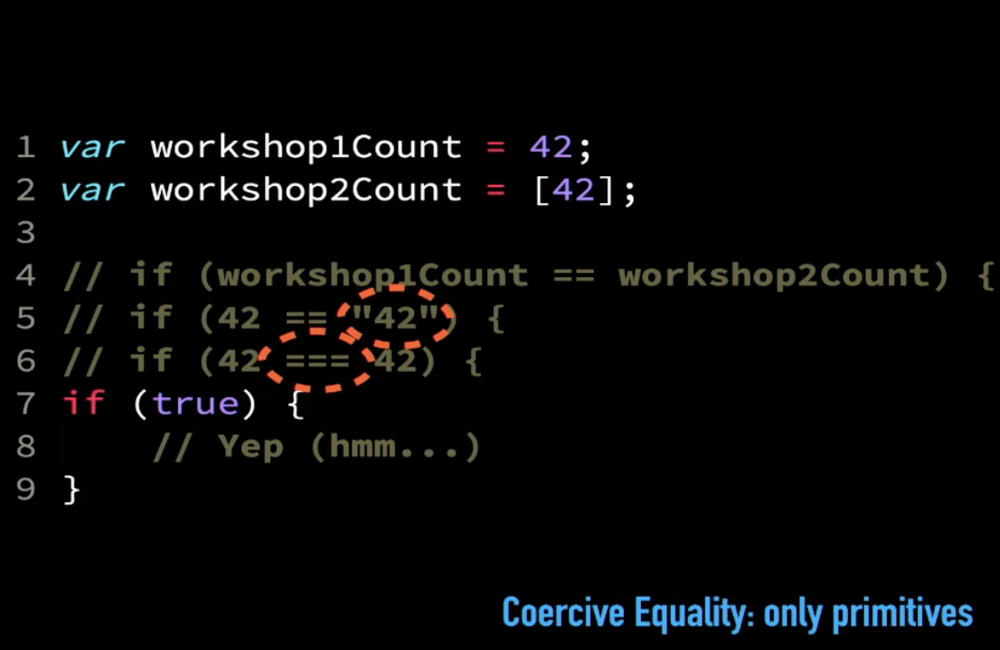
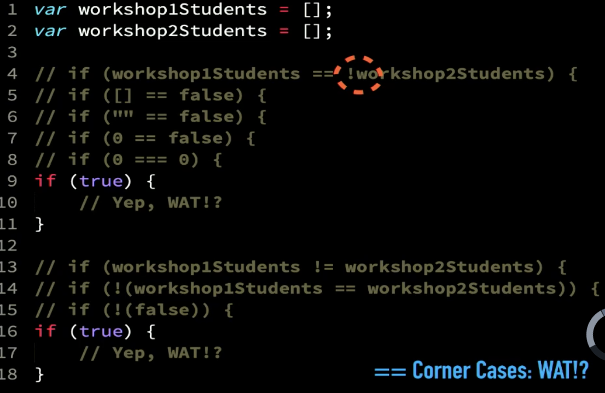
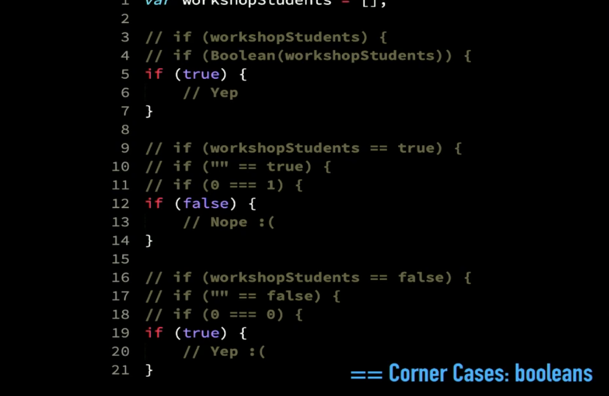
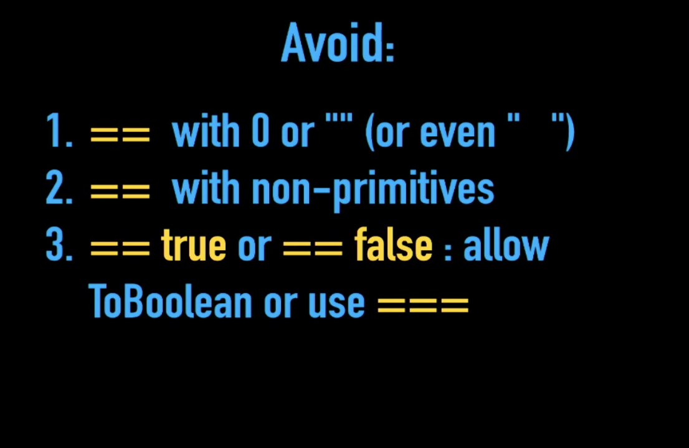

# Day 12: Philosophy of Coercion - Equality - Static Typing:

### Philosophy of Coercion:

**As a Joiner Software Engineer and as a Developer, you must make sure to increase your knowledge of the tools you use like programming languages, developing and management tools and ... etc.** The code is your way to communicate with the others and improve to show your ideas, so it is nice to have comments but don't comment how (or what) is the code, code say that, but comment to show why the code does.

Implicit is a functionality do something under the hood, it's called a magic, but it's not clear so it's bad, but it's being better if understand what happens, it's a way of abstracting to let reader not focus on unnecessary things. Boxing is an example.

**Useful: when the reader is focused on what's important.**
**Dangerous: when the reader can't tell what will happen.**
**Better: when the reader understands the code.**

### Equality:

In JavaScript, double equal (==) and triple equal (===) is doing the same with types, they are checking the types. In triple equal, if the types compared is not matched then will not do anything. If they matched then will return false x is NaN, and true if one is 0 and other is -0. So we say, double equal (==) allows coercion (types different), triple equal (===) disallows coercion (type same). Double equal (==) compare null and undefined and the result is true (here the double equal is more useful). Also it's prefer to convert the values to numbers (== preferred in these cases). If one of the values is string, number or symbol (primitive values) and the other value is an object (non-primitive) the object will convert using Primitive() then compare. Double equal (==) is faster than triple equal (===).



> == Summary: If the types are the same: ===, If null or undefined: equal, If non-primitives: ToPrimitive , Prefer: ToNumber

**Corner Case with ==**





**Scenarios to Avoid with ==**



> Use == when you know the types. And when the types obvious clear to the reader.

### Static Typing:

For example, TypeScript, Flow and type-aware. Benefits:
1. Catch type-related mistakes.
2. Communicate type intent.
3. Provide IDE feedback.
Caveats:
1. Inferencing is best-guess, not a guarantee.
2. Annotations are optional.
3. Any part of the application that isn't typed introduces uncertainty.

- JavaScript has a (dynamic) type system, which uses various forms of coercion for value type conversion, including equality comparisons.
- Part of the problem with avoidance of whole swaths of JS, like pretending === saves you from needing to know types, is that it tends to systemically perpetuate bugs.
- You simply cannot write quality JS programs without knowing the types involved in your operations.
- Alternately, many choose to adopt a different "static types" system layered on top, while certainly helpful in some respects, this is "avoidance" of a different sort.
- Many claim that JS's type system is too difficult for newer developers to learn, and that static types are (somehow) more learnable.
- **The better approach is to embrace and learn JS's type system, and to adopt a coding style which makes types as obvious as possible. By doing so, you will make your code more readable and more robust, for experienced and new developers alike.**

## Checkpoint Summary :vertical_traffic_light:

The key points covered:

- Code comments should explain "why," not "how."
- What is the impact of implicit functionality in code?
- How do double equal (==) and triple equal (===) differ in handling types?
- Use == when types are clear.
- Double equal (==) compares null and undefined as true.
- TypeScript and others catch type-related mistakes.
- Coding style should make types obvious.
- Why is it important to embrace and learn JavaScript's type system?

---

### Question 1:
TODO: write the validation functions
**Instructions:**
1. The findAll(.) function takes a value and an array. It returns an array.
2. The coercive matching that is allowed:
    - exact matches (Object.is(..)')
    - strings (except '" or whitespace-only) can match numbers numbers (except NaN and +/- Infinity") can match strings hint: watch out for -0'!)
    - null can match undefined, and vice versa
    - booleans can only match booleans
    - objects only match the exact same object

```javascript
    const isValidName = (name) => {
        if (typeof name == 'string' && name.length >= 3)
        return true;
    }

    const hoursAttended = (attended, length) => {
        if (typeof attended == 'string' && attended.trim() != '')
            attended = Number(attended);
        if (typeof length == 'string' && length.trim() != '')
            length = Number(length);
        if (typeof attended == 'number' && typeof length == 'number' &&
        attended >= 0 && length >= 0 &&
        attended%1 == 0 && length%1 == 0
        attended <= length)
            return false;
        if (attended > length)
            return false;
        return true;
    }

    // tests:
    console.log(isValidName("Frank") === true);
    console.log(hoursAttended(6,10) === true);
    console.log(hoursAttended(6,"10") === true);
    console.log(hoursAttended("6",10) === true);
    console.log(hoursAttended("6","10") === true);

    console.log(isValidName(false) === false);
    console.log(isValidName(null) === false);
    console.log(isValidName(undefined) === false);
    console.log(isValidName("") === false);
    console.log(isValidName("  \t\n") === false);
    console.log(isValidName("X") === false);
    console.log(hoursAttended("",6) === false);
    console.log(hoursAttended(6,"") === false);
    console.log(hoursAttended("","") === false);
    console.log(hoursAttended("foo",6) === false);
    console.log(hoursAttended(6,"foo") === false);
    console.log(hoursAttended("foo","bar") === false);
    console.log(hoursAttended(null,null) === false);
    console.log(hoursAttended(null,undefined) === false);
    console.log(hoursAttended(undefined,null) === false);
    console.log(hoursAttended(undefined,undefined) === false);
    console.log(hoursAttended(false,false) === false);
    console.log(hoursAttended(false,true) === false);
    console.log(hoursAttended(true,false) === false);
    console.log(hoursAttended(true,true) === false);
    console.log(hoursAttended(10,6) === false);
    console.log(hoursAttended(10,"6") === false);
    console.log(hoursAttended("10",6) === false);
    console.log(hoursAttended("10","6") === false);
    console.log(hoursAttended(6,10.1) === false);
    console.log(hoursAttended(6.1,10) === false);
    console.log(hoursAttended(6,"10.1") === false);
    console.log(hoursAttended("6.1",10) === false);
    console.log(hoursAttended("6.1","10.1") === false);
```

### Question 2:
TODO: write `findAll(..)`

```javascript
    function findAll(match,arr) {
        var ret = [];
        for (let v of arr) {
            if (Object.is(match,v)) {
                ret.push(v);
            } else if (match == null && v == null) {
                ret.push(v);
            } else if (typeof match == "boolean") {
                if (match === v) {
                    ret.push(v);
                }
            } else if (typeof match == "string" && match.trim() != "" && typeof v == "number" && !Object.is(-0,v)) {
                if (match == v) {
                    ret.push(v);
                }
            } else if (typeof match == "number" && !Object.is(match,-0) && !Object.is(match,NaN) && !Object.is(match,Infinity) && !Object.is(match,-Infinity) && typeof v == "string" && v.trim() != "") {
                if (match == v) {
                    ret.push(v);
                }
            }
        }
            return ret;
    }


    // tests:
    var myObj = { a: 2 };

    var values = [
        null, undefined, -0, 0, 13, 42, NaN, -Infinity, Infinity,
        "", "0", "42", "42hello", "true", "NaN", true, false, myObj
    ];

    console.log(setsMatch(findAll(null,values),[null,undefined]) === true);
    console.log(setsMatch(findAll(undefined,values),[null,undefined]) === true);
    console.log(setsMatch(findAll(0,values),[0,"0"]) === true);
    console.log(setsMatch(findAll(-0,values),[-0]) === true);
    console.log(setsMatch(findAll(13,values),[13]) === true);
    console.log(setsMatch(findAll(42,values),[42,"42"]) === true);
    console.log(setsMatch(findAll(NaN,values),[NaN]) === true);
    console.log(setsMatch(findAll(-Infinity,values),[-Infinity]) === true);
    console.log(setsMatch(findAll(Infinity,values),[Infinity]) === true);
    console.log(setsMatch(findAll("",values),[""]) === true);
    console.log(setsMatch(findAll("0",values),[0,"0"]) === true);
    console.log(setsMatch(findAll("42",values),[42,"42"]) === true);
    console.log(setsMatch(findAll("42hello",values),["42hello"]) === true);
    console.log(setsMatch(findAll("true",values),["true"]) === true);
    console.log(setsMatch(findAll(true,values),[true]) === true);
    console.log(setsMatch(findAll(false,values),[false]) === true);
    console.log(setsMatch(findAll(myObj,values),[myObj]) === true);

    console.log(setsMatch(findAll(null,values),[null,0]) === false);
    console.log(setsMatch(findAll(undefined,values),[NaN,0]) === false);
    console.log(setsMatch(findAll(0,values),[0,-0]) === false);
    console.log(setsMatch(findAll(42,values),[42,"42hello"]) === false);
    console.log(setsMatch(findAll(25,values),[25]) === false);
    console.log(setsMatch(findAll(Infinity,values),[Infinity,-Infinity]) === false);
    console.log(setsMatch(findAll("",values),["",0]) === false);
    console.log(setsMatch(findAll("false",values),[false]) === false);
    console.log(setsMatch(findAll(true,values),[true,"true"]) === false);
    console.log(setsMatch(findAll(true,values),[true,1]) === false);
    console.log(setsMatch(findAll(false,values),[false,0]) === false);

    // ***************************

    function setsMatch(arr1,arr2) {
        if (Array.isArray(arr1) && Array.isArray(arr2) && arr1.length == arr2.length) {
            for (let v of arr1) {
                if (!arr2.includes(v)) return false;
            }
            return true;
        }
        return false;
    }
```

---

### Sources to review
- #### [MDN](https://developer.mozilla.org/)
- #### [Free code camp](https://www.freecodecamp.org/)