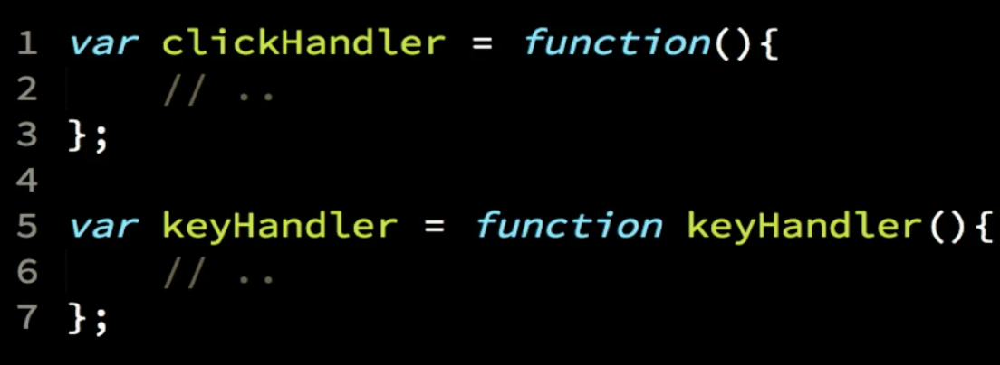

# Day 13: Scope - Scope & Function Expressions:

### Scope:

Scope is where to look for things. Compilation (compiler) Theory, there are essentially four stages to compile. Sometimes first two stages are combined to on stage, sometimes there separate. They are lexical and tokenization, parsing, which turns the stream of tokens into what's called an abstract syntax tree. And then the last step is what's called code generation, taking an abstract syntax tree and producing some kind of other executable form of that program. So JavaScript will process the code first, set up the scopes, then execute it. JavaScript organized the scopes with functions and blocks.
Shadowing is when declaring a new variable in the inner scope, it work with lexical scope. Lexical scope is determined at compile time and used in the runtime.
Right Hand Side we can call it the label or the target of the statement like variables, Left Hand Side we can call it the content or the source of the statement like functions. If the scope not fined (non-strict mode) the target (variable) then will search in global scope, if it exists will work regularly, if not, it will defined one in global.
"use strict"; is not allow the lexical scoping to happen in previous case. (And we have nested scopes)
Undefined is that the variable exist but not have a value assigned to it, or it had a value later and now not have no longer a value. Undeclared is actually never formally declared in any scope that we have accessed to.

### Scope & Function Expressions:

Function expression is when the function was in the right hand side of statement, there exist two types of function expressions, first called anonymise function and the other called named function.


> Always prefer named function expressions.

## Checkpoint Summary :vertical_traffic_light:

The key points covered:

- Four stages of compilation in compiler theory.
- How does JavaScript organize scopes?
- Shadowing and its relationship with lexical scope.
- Right Hand Side and Left Hand Side.
- The role of "use strict".
- The distinction between "undefined" and "undeclared" variables.
- Two types of function expressions: anonymous and named.

---

### Question 1:
TODO : getStudentById(studentId)
TODO : printRecords (recordIds)
TODO : paidStudentsToEnroll()
TODO : remindUnpaid (recordIds)
All as regular functions.

```javascript
    function getStudentFromId(studentId) {
        return studentRecords.find(function matchId(record){
            return (record.id == studentId);
        });
    }

    function printRecords(recordIds) {
        var records = recordIds.map(getStudentFromId);

        records.sort(function sortByNameAsc(record1,record2){
            if (record1.name < record2.name) return -1;
            else if (record1.name > record2.name) return 1;
            else return 0;
        });

        records.forEach(function printRecord(record){
            console.log(`${record.name} (${record.id}): ${record.paid ? "Paid" : "Not Paid"}`);
        });
    }

    function paidStudentsToEnroll() {
        var recordsToEnroll = studentRecords.filter(function needToEnroll(record){
            return (record.paid && !currentEnrollment.includes(record.id));
        });

        var idsToEnroll = recordsToEnroll.map(function getStudentId(record){
            return record.id;
        });

        return [ ...currentEnrollment, ...idsToEnroll ];
    }

    function remindUnpaid(recordIds) {
        var unpaidIds = recordIds.filter(function notYetPaid(studentId){
            var record = getStudentFromId(studentId);
            return !record.paid;
        });

        printRecords(unpaidIds);
    }

    // ********************************

    var currentEnrollment = [ 410, 105, 664, 375 ];

    var studentRecords = [
        { id: 313, name: "Frank", paid: true, },
        { id: 410, name: "Suzy", paid: true, },
        { id: 709, name: "Brian", paid: false, },
        { id: 105, name: "Henry", paid: false, },
        { id: 502, name: "Mary", paid: true, },
        { id: 664, name: "Bob", paid: false, },
        { id: 250, name: "Peter", paid: true, },
        { id: 375, name: "Sarah", paid: true, },
        { id: 867, name: "Greg", paid: false, },
    ];

    printRecords(currentEnrollment);
    console.log("----");
    currentEnrollment = paidStudentsToEnroll();
    printRecords(currentEnrollment);
    console.log("----");
    remindUnpaid(currentEnrollment);

    /*
        Bob (664): Not Paid
        Henry (105): Not Paid
        Sarah (375): Paid
        Suzy (410): Paid
        ----
        Bob (664): Not Paid
        Frank (313): Paid
        Henry (105): Not Paid
        Mary (502): Paid
        Peter (250): Paid
        Sarah (375): Paid
        Suzy (410): Paid
        ----
        Bob (664): Not Paid
        Henry (105): Not Paid
    */
```

### Question 1:
TODO : getStudentById(studentId)
TODO : printRecords (recordIds)
TODO : paidStudentsToEnroll()
TODO : remindUnpaid (recordIds)
All as arrow functions.

```javascript
    var getStudentFromId = studentId => studentRecords.find(record => record.id == studentId);

    var printRecords = recordIds =>
        recordIds.map(getStudentFromId)
            .sort(
                (record1,record2) => record1.name < record2.name ? -1 : record1.name > record2.name ? 1 : 0
            )
            .forEach(record =>
                console.log(`${record.name} (${record.id}): ${record.paid ? "Paid" : "Not Paid"}`)
            );

    var paidStudentsToEnroll = () =>
        [ ...currentEnrollment,
            ...(
                studentRecords.filter(record => (record.paid && !currentEnrollment.includes(record.id)))
                .map(record => record.id)
            )
        ];

    var remindUnpaid = recordIds =>
        printRecords(
            recordIds.filter(studentId => !getStudentFromId(studentId).paid)
        );


    // ********************************

    var currentEnrollment = [ 410, 105, 664, 375 ];

    var studentRecords = [
        { id: 313, name: "Frank", paid: true, },
        { id: 410, name: "Suzy", paid: true, },
        { id: 709, name: "Brian", paid: false, },
        { id: 105, name: "Henry", paid: false, },
        { id: 502, name: "Mary", paid: true, },
        { id: 664, name: "Bob", paid: false, },
        { id: 250, name: "Peter", paid: true, },
        { id: 375, name: "Sarah", paid: true, },
        { id: 867, name: "Greg", paid: false, },
    ];

    printRecords(currentEnrollment);
    console.log("----");
    currentEnrollment = paidStudentsToEnroll();
    printRecords(currentEnrollment);
    console.log("----");
    remindUnpaid(currentEnrollment);

    /*
        Bob (664): Not Paid
        Henry (105): Not Paid
        Sarah (375): Paid
        Suzy (410): Paid
        ----
        Bob (664): Not Paid
        Frank (313): Paid
        Henry (105): Not Paid
        Mary (502): Paid
        Peter (250): Paid
        Sarah (375): Paid
        Suzy (410): Paid
        ----
        Bob (664): Not Paid
        Henry (105): Not Paid
    */
```

---

### Sources to review
- #### [MDN](https://developer.mozilla.org/)
- #### [Free code camp](https://www.freecodecamp.org/)