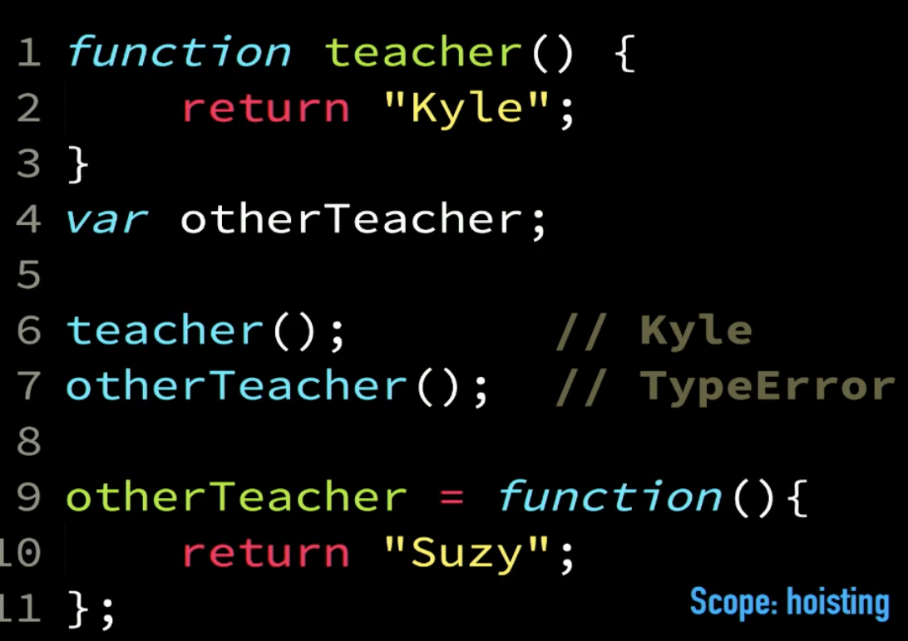
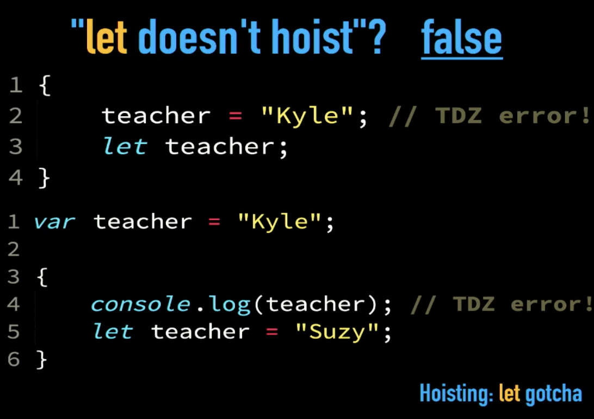

# Day 14: Advanced Scope:

### Advanced Scope:

- Lexical scope (static scope): can access variables from the outer scope, outer scope can't access variables from the inner scope (is determined at author time).
- Dynamic scope: the execution of code change depends on the place where it called from, it is scope that is determined based upon the conditions at runtime.
- Function scope. (The principle and the 3 points under for this scope)
- Block scope: occur when use carly braces (The principle and the 3 points under for this scope, too), it's litter than function scope. Use let or const, not var in it, so the block scope be itself with these  ES6 keywords.

> The principle of **least exposure or least privilege**: You should default to keeping everything private, and only exposing the minimal necessary.

As a matter of fact, there are three main problems that we solve by this defensive approach of the least exposure or least prevalent principle:
1. Avoiding Naming Collisions: The defensive approach reduces naming collision problems by limiting the scope or exposure of elements, preventing conflicts.
2. Preventing Misuse: Hiding elements prevents accidental or intentional misuse, as exposing them makes them accessible to all, leading to unintended use.
3. Protecting Future Refactoring: By hiding implementation details or variables, you safeguard against constraints on future refactoring, as exposing elements can lead to dependencies that hinder changes.

We  have IIFE, Immediately Invoked Function Expression, like this anonymous: **(function name() { // ...}) ()**

> There are both semantic reasons and behavioral reasons why I think var and let should coexist in your program rather than having one be the other.

For block scope, we called the block scope used in another scope that contains a few lines of code that not used in another place(s) as **explicit let block**.

> const means that the variable will not be reassigned. const say: for the rest of this block, I promise it's not gonna get reassigned. (so use the const with immutable data types needed)

Hoisting is not a Real Definition, Using this Relocating the Declarations for Functions and Variables.  The use of Function Expression is Good But Suitability Depends on the Situation


**let & const Hoisting:**

1. (let)s and (const)s only hoist to a block, whereas vars hoist to a function.
2. The key distinction between 'var' and 'let'/'const' lies in their variable creation behavior. 'var' plans and initializes variables during compile time within its scope, setting them to 'undefined' at the start of the scope. On the other hand, 'let' and 'const' create variables without initialization during hoisting, leaving them uninitialized (i.e., "don't touch them") until they are explicitly assigned a value.


> TDZ is invented for const mainly. (TDZ: Temporal Dead Zone)

> Put all your (let)s, or if you really insist on (const)s, put them all at the very top of the block, on the very first line. And then you'll never be able to observe a TDZ. Don't string them throughout those scopes, that's a bad idea.

## Checkpoint Summary :vertical_traffic_light:

The key points covered:

- Lexical scope (static scope) vs. dynamic scope.
- Function scope and its principles.
- Block scope and its principles.
- The importance of using let or const in block scope, rather than var.
- The principle of "least exposure or least privilege" in scope management.
- How does the principle of "least exposure or least privilege" benefit code organization?
- IIFE (Immediately Invoked Function Expression).
- The semantic and behavioral reasons for using both var and let/const.
- Block scope called "explicit let block."
- The use of const with immutable data types.
- Explanation of hoisting and how it differs between var and let/const.
- What is the TDZ? and Why is it mainly associated with const?
- Recommendations for organizing let and const declarations within a block scope.

---

### Question 1:
TODO: Refactor this code

```javascript
    var currentEnrollment = [ 410, 105, 664, 375 ];

    var studentRecords = [
        { id: 313, name: "Frank", paid: true, },
        { id: 410, name: "Suzy", paid: true, },
        { id: 709, name: "Brian", paid: false, },
        { id: 105, name: "Henry", paid: false, },
        { id: 502, name: "Mary", paid: true, },
        { id: 664, name: "Bob", paid: false, },
        { id: 250, name: "Peter", paid: true, },
        { id: 375, name: "Sarah", paid: true, },
        { id: 867, name: "Greg", paid: false, },
    ];

    printRecords(currentEnrollment);
    console.log("----");
    currentEnrollment = paidStudentsToEnroll();
    printRecords(currentEnrollment);
    console.log("----");
    remindUnpaid(currentEnrollment);

    /*
        Bob (664): Not Paid
        Henry (105): Not Paid
        Sarah (375): Paid
        Suzy (410): Paid
        ----
        Bob (664): Not Paid
        Frank (313): Paid
        Henry (105): Not Paid
        Mary (502): Paid
        Peter (250): Paid
        Sarah (375): Paid
        Suzy (410): Paid
        ----
        Bob (664): Not Paid
        Henry (105): Not Paid
    */


    // ********************************

    function getStudentFromId(studentId) {
        return studentRecords.find(matchId);

        // *************************

        function matchId(record) {
            return (record.id == studentId);
        }
    }

    function printRecords(recordIds) {
        var records = recordIds.map(getStudentFromId);

        records.sort(sortByNameAsc);

        records.forEach(printRecord);
    }

    function sortByNameAsc(record1,record2){
        if (record1.name < record2.name) return -1;
        else if (record1.name > record2.name) return 1;
        else return 0;
    }

    function printRecord(record) {
        console.log(`${record.name} (${record.id}): ${record.paid ? "Paid" : "Not Paid"}`);
    }

    function paidStudentsToEnroll() {
        var recordsToEnroll = studentRecords.filter(needToEnroll);

        var idsToEnroll = recordsToEnroll.map(getStudentId);

        return [ ...currentEnrollment, ...idsToEnroll ];
    }

    function needToEnroll(record) {
        return (record.paid && !currentEnrollment.includes(record.id));
    }

    function getStudentId(record) {
        return record.id;
    }

    function remindUnpaid(recordIds) {
        var unpaidIds = recordIds.filter(notYetPaid);

        printRecords(unpaidIds);
    }

    function notYetPaid(studentId) {
        var record = getStudentFromId(studentId);
        return !record.paid;
    }
```

---

### Sources to review
- #### [MDN](https://developer.mozilla.org/)
- #### [Free code camp](https://www.freecodecamp.org/)