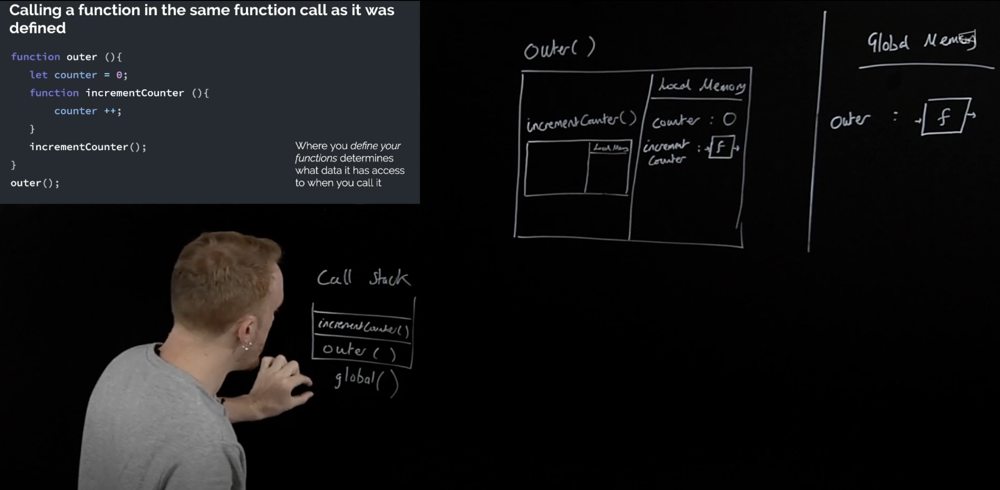

# Day 8: Closures - Async JS - first 30 minutes

### Closures:

Closure is the most esoteric of JavaScript concepts, enables powerful pro-level functions like ‘once’ and ‘memoize’. Many JavaScript design patterns including the module pattern use closure. Closure build iterators, handle partial application and maintain state in an asynchronous world. The function local space called state. Local memory has the variable environment, it's another name for local memory (V.E. : variables, constants, functions ... etc). We can return a function as returned value from the other function. When JavaScript runs a line  of code it's not returned it anymore.




When I return a function as a result of another function, it will have a backpack that memories all the local memory surrounds from its global function (or its outer function), if we have a variables we don't use in the function so this will cause a memory leak. The backpack data is secure private and no one can access it because it's hidden ( [[scope]] ), so this function can remember previous value running and interact depending on it (like allow to run the function only one time). The backpack called C.O.V.E. (Closed Over Variables Environment code), and called P.L.S.R.D. (Persistent Lexical StaticScope Reference Data) or Closure too. But in reality the backpack is a result of C.O.V.E , P.L.S.R.D. and Closure in JavaScript.

- Hint : What are Decorators in JavaScript? The word decorator means combining a set of code or program with another or can be said as wrapping a function with another function to extends the functionality or working of the function. Decorator can also be called as decorator function.
- Scope: It's the rules for any line of code that announce what data do I have available to me in it.

In JavaScript we have lexical scope (static scope) that means the line can access the variables in upper (outer) scope and save its current variables in its local scope. If we create a new variable from the lexical scope each time I used it, if I log the counter, it will be 1 in each functions call, and If I have counter in global scope, it will be 1, 2, 3 ... etc, as much as I call the function.

Closure gives our functions persistent memories and entirely new toolkit for writing professional code:
- Helper functions: Everyday professional helper functions like ‘once’ and ‘memoize’.
- Iterators and generators: Which use lexical scoping and closure to achieve the most contemporary patterns for handling data in JavaScript.
- Module pattern: Preserve state for the life of an application without polluting the global namespace.
- Asynchronous JavaScript: Callbacks and Promises rely on closure to persist state in an asynchronous environment.


### Asynchronous JavaScript:


## Checkpoint Summary :vertical_traffic_light:

The key points covered:

- What is the Closure?
- How Closure works?
- What is the Backpack? What is the various names?
- What is the scope?
- Benefits of Closure.

---

### Question 1:
Write a closure named createCounter that takes an initial value start and returns a function. The returned function, when invoked, should increment the counter by 1 and return the updated value.

```javascript
    const createCounter = (start) => {
        const increase = () => {
            // console.log("Value before: " + start);
            start ++;
            // console.log("Value after: " + start);
        }
        return increase;
    }
    const counter = createCounter(3);
    counter();
    counter();
```

### Question 2:
Write a closure named calculateAverage that takes an array of numbers, nums, and returns a function. The returned function, when invoked, should calculate and return the average of the numbers in the array.

```javascript
    const calculateAverage = (nums) => {
        let sum = 0;
        const average = () => {
            for (let i = 0; i < nums.length; i++) {
                sum += nums[i];
            }
            const theAverage = sum / nums.length;
            sum = 0;
            return theAverage;
        }
        return average;
    }

    const calcAvg = calculateAverage([1,2,3,4,5,6,7]);
    console.log(calcAvg()); // 4
    const calcAvg2 = calculateAverage([3,4,5,6,7,8]);
    console.log(calcAvg2()); // 5.5
```

### Question 3:
Write a closure named powerOf that takes a base number base and returns a function. The returned function, when invoked with an exponent exp, should calculate and return the result of base raised to the power of exp.

```javascript
    const powerOf = (base) => {
        const raiser = (exponent) => base**exponent;
        return raiser;
    }

    const powersOf2 = powerOf(2);
    console.log(powerOf2(10)); // 1024
```

### Question 4:
Write a closure named compose that takes multiple functions as arguments and returns a new function. The returned function should apply the provided functions in reverse order, passing the result of each function as an argument to the next function.

```javascript
    const compose = (...functions) => {
        return function(arg) { // 4. returns the composed function
            return functions.reduceRight((result, func) => { // 3. execute functions in reverse order
                return func(result); // 2. result of executing function
            }, arg); // 1. initial arg start execution
        };
    };

    // Example usage:
    const subtractTwo = (x) => x - 2;
    const multiplyByThree = (x) => x * 3;
    const square = (x) => x**2;

    const combinedFunction = compose(subtractTwo, multiplyByThree, square);

    const result = combinedFunction(10); // Equivalent to subtractFive(multiplyByThree(addTwo(10)))
    console.log(result); // Output: 298
```

---

### Sources to review
- #### [MDN](https://developer.mozilla.org/)
- #### [Free code camp](https://www.freecodecamp.org/)