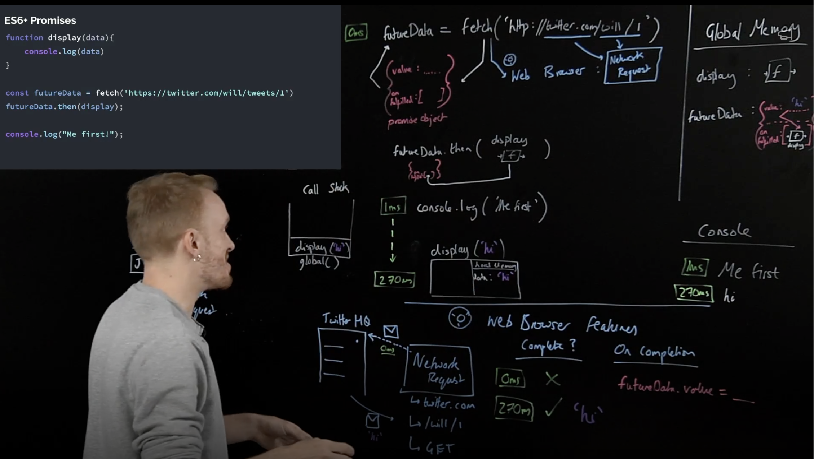
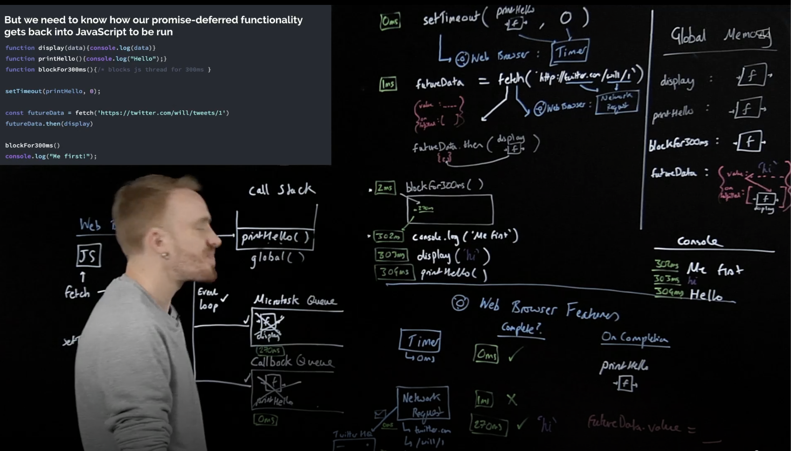

# Day 9: Async JS - second 30 minutes & Promises

### Asynchronous JavaScript (cont) & Promises:

We need to add some new components:
- Web Browser APIs/Node background APIs
- Promises
- Event loop, Callback/Task queue and micro task queue
What have we in Web Browser in addition to JavaScript?
- Dev tools
- Console (in JavaScript equivalent to console)
- Sockets
- Network requests (in JavaScript equivalent to fetch)
- HTML DOM (rendering) (in JavaScript equivalent to document)
- Timer (in JavaScript equivalent to setTimeout)

This image shows how the JavaScript engine behaves with synchronous code and asynchronous code execution.


This image shows how the JavaScript work with execution context, callbacks and event loop. In event loop, the JavaScript engine checks whether the execution in callStack is empty or not, then checks whether the global is done or yet, last if all done, it will execute what in the callbacks queue.


ES5 Web Browser APIs with callback functions:
Problems:
- Our response data is only available in the callback function (callback hell).
- Maybe it feels a little odd to think of passing a function into another function only for it to run much later.
Benefits:
- Super explicit once you understand how it works under-the-hood.

ES6+ Solution (Promises):
Using two-pronged ‘facade’ functions that both:
- Initiate background web browser work
- Return a placeholder object (promise) immediately in JavaScript.

We have two things in Promise Objects, first is value key with response data as its value, second is  "on fulfilled" key with hidden data (like function to execute after response) as its value, one more hidden is "on rejected" used in catch(), the and the promise object itself have .then() method used when been fulfilled and stored in fulfilled hidden value (functions or lines of code), .catch() method used when been rejected and finally() method used when finish the promise. The promise object value is passed automatically to the fulfilled function(s) when it is updated.


> Link passed to fetch('Link') have two parts, the domain(serves name to access) and the path(data location in the domain).



Promises, Problems
- 99% of developers have no idea how they’re working under the hood.
- Debugging becomes super-hard as a result.
- Developers fail technical interviews.
Benefits:
- Cleaner readable style with pseudo-synchronous style code.
- Nice error handling process.

## Checkpoint Summary :vertical_traffic_light:

The key points covered:

- Browser Features.
- Web APIs work.
- Callback Queue & Event Loop.
- ES5 & ES6+
- Callback Queue & Microtask Queue

---

### Question 1:
You are given a function executeInSequenceWithCBs and some code. The task is to modify the executeInSequenceWithCBs function so that it runs and executes all the tasks inside the asyncTasks array.
The function should return an array of messages obtained from each task's execution.
You are only allowed to change the executeInSequenceWithCBs function or add new functions/code. You cannot modify the tasks' functions.

```javascript
    const task1 = (cb) => setTimeout(() => {
        const message = "Task 1 has executed successfully!";
        cb(message);
    }, 3000)

    const task2 = (cb) => setTimeout(() => {
        const message = "Task 2 has executed successfully!";
        cb(message);
    }, 0)

    const task3 = (cb) => setTimeout(() => {
        const message = "Task 3 has executed successfully!";
        cb(message);
    }, 1000)

    const task4 = (cb) => setTimeout(() => {
        const message = "Task 4 has executed successfully!";
        cb(message);
    }, 2000)

    const task5 = (cb) => setTimeout(() => {
        const message = "Task 5 has executed successfully!";
        cb(message);
    }, 4000)

    const asyncTasks = [task1, task2, task3, task4, task5];

    const callback = (msg) => console.log(msg);

    const executeInSequenceWithCBs = (tasks, callback) => {
        for (const task of tasks) {
            task(callback);
        }
    }
    executeInSequenceWithCBs(asyncTasks, callback);
```

### Question 2:
You are given a function called executeInParallelWithPromises, which takes an array of APIs (represented by objects).
Your task is to write code that fetches the data of each API in parallel using promises. In Parallel means that the api which resolves first, returns its value first, regardless of the execution order.
The output of the executeInParallelWithPromises function should be an array containing the results of each API's execution.
Each result should be an object with three keys: apiName, apiUrl, and apiData.

```javascript
    const apis = [
    {
        apiName: "products", 
        apiUrl: "https://dummyjson.com/products",
    }, 
    {
        apiName: "users", 
        apiUrl: "https://dummyjson.com/users",
    }, 
    {
        apiName: "posts", 
        apiUrl: "https://dummyjson.com/posts",
    }, 
    {
        apiName: "comments", 
        apiUrl: "https://dummyjson.com/comments",
    }
    ]

    const executeInParallelWithPromises = async (apis) => {
        const result = [];
        for (const api of apis) {
            result.push(api);
        }
        for(let api of result) {
            const fetchedData = await fetch(api.apiUrl);
            const data = await fetchedData.json();
            api.apiData = data;
        }
        return result;
    }
    const response = await executeInParallelWithPromises(apis);
```

### Question 3:
You are given a function called executeInSequenceWithPromises, which takes an array of APIs (represented by objects).
Your task is to write code that fetches the data of each API sequentially (one after the other) using promises.
In Sequence means that the api which executes first, returns its value first.
The output of the executeInSequenceWithPromises function should be an array containing the results of each API's execution.
Each result should be an object with three keys: apiName, apiUrl, and apiData.

```javascript
    const apis = [
    {
        apiName: "products", 
        apiUrl: "https://dummyjson.com/products",
    }, 
    {
        apiName: "users", 
        apiUrl: "https://dummyjson.com/users",
    }, 
    {
        apiName: "posts", 
        apiUrl: "https://dummyjson.com/posts",
    }, 
    {
        apiName: "comments", 
        apiUrl: "https://dummyjson.com/comments",
    }
    ]

    const executeInSequenceWithPromises = async (apis) => {
        const result = [];
        for (const api of apis) {
            result.push(api);
        }
        for(let i = 0; i < result.length; i++) {
            const fetchedData = setTimeout(await fetch(result[i].apiUrl), i*1000);
            const data = await fetchedData.json();
            api.apiData = data;
        }
        return result;
    }
    const response = await executeInSequenceWithPromises(apis);
```

---

### Sources to review
- #### [MDN](https://developer.mozilla.org/)
- #### [Free code camp](https://www.freecodecamp.org/)