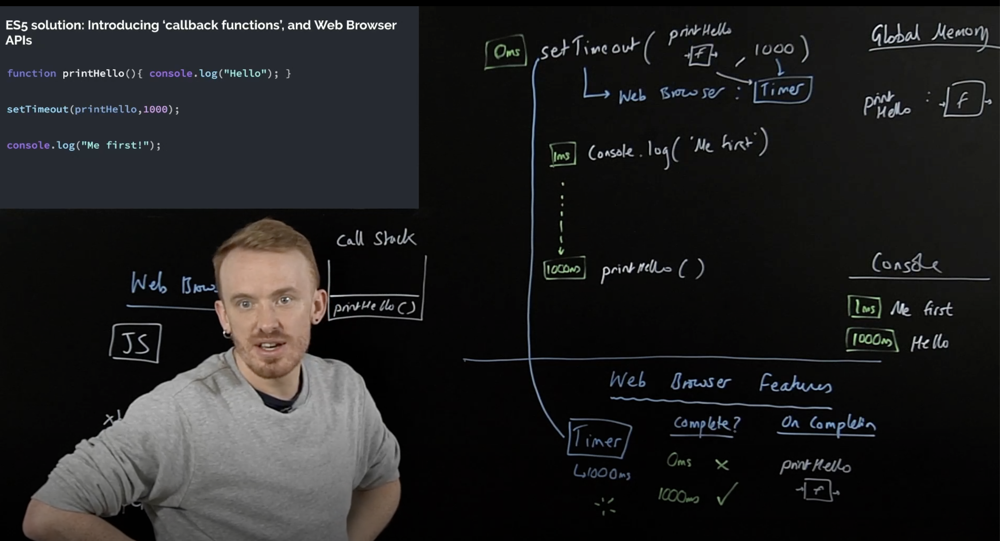
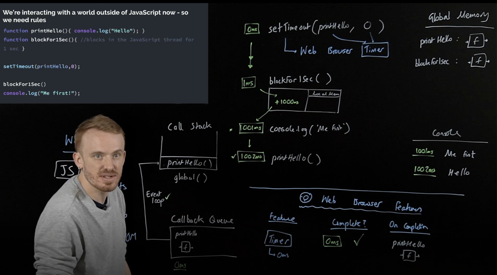

# Day 9: Async JS - second 30 minutes

### Asynchronous JavaScript (cont):

We need to add some new components:
- Web Browser APIs/Node background APIs
- Promises
- Event loop, Callback/Task queue and micro task queue
What have we in Web Browser in addition to JavaScript?
- Dev tools
- Console (in JavaScript equivalent to console)
- Sockets
- Network requests (in JavaScript equivalent to fetch)
- HTML DOM (rendering) (in JavaScript equivalent to document)
- Timer (in JavaScript equivalent to setTimeout)

This image shows how the JavaScript engine behaves with synchronous code and asynchronous code execution.


This image shows how the JavaScript work with execution context, callbacks and event loop. In event loop, the JavaScript engine checks whether the execution in callStack is empty or not, then checks whether the global is done or yet, last if all done, it will execute what in the callbacks queue.


## Checkpoint Summary :vertical_traffic_light:

The key points covered:

- Browser Feature.
- Web APIs work.
- Callback Queue & Event Loop.
- 

---

### Question 1:
Write a closure named createCounter that takes an initial value start and returns a function. The returned function, when invoked, should increment the counter by 1 and return the updated value.

```javascript
    const createCounter = (start) => {
        const increase = () => {
            // console.log("Value before: " + start);
            start ++;
            // console.log("Value after: " + start);
        }
        return increase;
    }
    const counter = createCounter(3);
    counter();
    counter();
```

---

### Sources to review
- #### [MDN](https://developer.mozilla.org/)
- #### [Free code camp](https://www.freecodecamp.org/)